Demografía del parentesco: introducción a temas y métodos
================
Facilitador: Diego Alburez-Gutierrez (MPIDR);
Pre-evento del X Congreso ALAP; Valparaíso, Chile - 6 Dic 2022

  - [Primera parte: Introducción a la Demografía del
    Parentesco](#primera-parte-introducción-a-la-demografía-del-parentesco)
  - [Segunda parte: modelos de parentesco en
    R](#segunda-parte-modelos-de-parentesco-en-r)
      - [1. Instalación de DemoKin](#1-instalación-de-demokin)
      - [2. Cómo descargar datos de Naciones Unidas para este
        taller](#2-cómo-descargar-datos-de-naciones-unidas-para-este-taller)
      - [3. La función `kin()`](#3-la-función-kin)
      - [4. Demostración: tamaño de redes familiares en Guatemala
        (poblaciones
        estables)](#4-demostración-tamaño-de-redes-familiares-en-guatemala-poblaciones-estables)
      - [5. Viñeta y extensiones](#5-viñeta-y-extensiones)
  - [Ejercicios](#ejercicios)
      - [Ejercicio 1: Parentesco en América Latina (poblaciones
        estables)](#ejercicio-1-parentesco-en-américa-latina-poblaciones-estables)
      - [Ejercicio 2: Abuelos en poblaciones no
        estables](#ejercicio-2-abuelos-en-poblaciones-no-estables)
      - [Ejercicio 3. Parientes vivos y
        muertos](#ejercicio-3-parientes-vivos-y-muertos)
      - [Ejercicio 4. Edad promedio de los
        parientes](#ejercicio-4-edad-promedio-de-los-parientes)
      - [Ejercicio 5. Madres](#ejercicio-5-madres)
      - [Ejercicio 6. Generación
        Sandwich](#ejercicio-6-generación-sandwich)
      - [Session info](#session-info)
      - [References](#references)

# Primera parte: Introducción a la Demografía del Parentesco

Las diapositivas para la primera parte están disponibles
[aquí](diapositivas/).

# Segunda parte: modelos de parentesco en R


## 1\. Instalación de DemoKin

Instale el paquete `DemoKin` [desde
GitHub](https://github.com/IvanWilli/DemoKin) (puede tomar \~1 minuto).

``` r
# remove.packages("DemoKin")
# install.packages("devtools")
devtools::install_github("IvanWilli/DemoKin", build_vignettes = TRUE)
```

Cargue algunos paquetes:

``` r
library(DemoKin)
library(dplyr)
library(tidyr)
library(purrr)
library(ggplot2)
library(fields)
```

## 2\. Cómo descargar datos de Naciones Unidas para este taller

Vamos a usar el API del [World Population
Prospects 2022](https://population.un.org/wpp/) para descargar los datos
que necesitamos para DemoKin.

Para esto, primero definimos una función para cargar los datos
directamente a la sesión de R:

``` r
get_UNWPP_inputs <- function(countries, my_startyr, my_endyr, variant = "Median"){

  print("Getting API ready...")
  # Get data from UN using API
  
  base_url <- 'https://population.un.org/dataportalapi/api/v1'
  
  # First, identify which indicator codes we want to use
  
  target <- paste0(base_url,'/indicators/?format=csv')
  codes <- read.csv(target, sep='|', skip=1) 
  
  qx_code <- codes$Id[codes$ShortName == "qx1"]
  asfr_code <- codes$Id[codes$ShortName == "ASFR1"]
  
  # Get location codes
  
  target <- paste0(base_url, '/locations?sort=id&format=csv')
  df_locations <- read.csv(target, sep='|', skip=1)
  
  # find the codes for countries
  
  my_location <- 
    df_locations %>% 
    filter( Name %in% countries) %>% 
    pull(Id) %>% 
    paste(collapse = ",")
  
  # Get px values
  
  print(paste0("Getting mortality data for ", paste(countries, collapse = ", ")))
  
  my_indicator <- qx_code
  my_location  <- my_location
  
  target <- paste0(base_url,
                   '/data/indicators/',my_indicator,
                   '/locations/',my_location,
                   '/start/',my_startyr,
                   '/end/',my_endyr,
                   '/?format=csv')
  
  px <- 
    read.csv(target, sep='|', skip=1) %>% 
    filter(Variant %in% variant) %>% 
    filter(Sex == "Female") %>% 
    mutate(px = 1- Value) %>% 
    select(Location, Time = TimeLabel, age = AgeStart, px)
  
  # ASFR
  
  print(paste0("Getting fertility data for ", paste(countries, collapse = ", ")))
  
  my_indicator <- asfr_code
  
  target <- paste0(base_url,
                   '/data/indicators/',my_indicator,
                   '/locations/',my_location,
                   '/start/',my_startyr,
                   '/end/',my_endyr,
                   '/?format=csv')
  
  asfr <- 
    read.csv(target, sep='|', skip=1) %>% 
    filter(Variant %in% variant) %>% 
    select(Location, Time = TimeLabel, age = AgeStart, ASFR = Value) %>% 
    mutate(ASFR = ASFR/1000)
  
  data <- 
    left_join(px, asfr, by = c("Location", "Time", "age")) %>% 
    mutate(ASFR = replace(ASFR,is.na(ASFR),0)) 
  
  data
}
```

Otras funciones utiles que usaremos más adelante:

``` r
# A small hack on the existing rename_kin function to make sure it keeps all columns
rename_kin2 <- function (df, consolidate_column = "no") {
  stopifnot(`Argument 'consolidate_column' should be 'no' or a valid column name` = consolidate_column %in% 
    c("no", colnames(df)))
  if (consolidate_column == "no") {
    relatives <- c("Cousins from older aunt", "Cousins from younger aunt", 
      "Daughter", "Grand-daughter", "Great-grand-daughter", 
      "Great-grandmother", "Grandmother", "Mother", "Nieces from older sister", 
      "Nieces from younger sister", "Aunt older than mother", 
      "Aunt younger than mother", "Older sister", "Younger sister")
    names(relatives) <- c("coa", "cya", "d", "gd", "ggd", 
      "ggm", "gm", "m", "nos", "nys", "oa", "ya", "os", 
      "ys")
  }
  else {
    consolidate_vec <- c("c", "c", "d", "gd", "ggd", "ggm", 
      "gm", "m", "n", "n", "a", "a", "s", "s")
    names(consolidate_vec) <- c("coa", "cya", "d", "gd", 
      "ggd", "ggm", "gm", "m", "nos", "nys", "oa", "ya", 
      "os", "ys")
    relatives <- c("Cousins", "Daughter", "Grand-daughter", 
      "Great-grand-daughter", "Great-grandmother", "Grandmother", 
      "Mother", "Nieces", "Aunt", "Sister")
    names(relatives) <- unique(consolidate_vec)
    df <- as.data.frame(df)
    df$count <- df[, consolidate_column]
    df <- df %>% dplyr::mutate(kin = consolidate_vec[kin]) %>% 
      dplyr::group_by(age_focal, kin, Location) %>% 
      dplyr::summarise(
        count = sum(count)
        , Location = unique(Location)
        ) %>% 
      dplyr::ungroup()
  }
  df$kin <- relatives[df$kin]
  df
}
```

Ahora, usemos la función `get_UNWPP_inputs` para descargar los datos que
necesitamos para nuestro modelos de parentesco. Para este ejemplo,
usemos datos de Guatemala:

``` r
# pick countries
countries <- c("Guatemala")

# Year range

my_startyr   <- 1950
my_endyr     <- 2020

data <- get_UNWPP_inputs(
  countries = countries
  , my_startyr = my_startyr
  , my_endyr = my_endyr
  )
```

    ## [1] "Getting API ready..."
    ## [1] "Getting mortality data for Guatemala"
    ## [1] "Getting fertility data for Guatemala"

### 2\. Visualizar los datos

Primero, transformamos los datos a matrices, el formato que DemoKin
requiere:

``` r
gt_px <- 
  data %>% 
  select(Time, age, px) %>%
  pivot_wider(names_from = Time, values_from = px) %>%
  select(-age) %>% 
  as.matrix()

gt_asfr <- 
  data %>% 
  select(Time, age, ASFR) %>%
  pivot_wider(names_from = Time, values_from = ASFR) %>%
  select(-age) %>% 
  as.matrix()
```

#### 2.1. `px` matriz; probabilidades de supervicencia por edad (argumento *U* en DemoKin)

Así se ven los datos:

``` r
gt_px[1:4, 1:4]
```

    ##           1950      1951      1952      1953
    ## [1,] 0.8357549 0.8365911 0.8383111 0.8401224
    ## [2,] 0.9579989 0.9569656 0.9574153 0.9584632
    ## [3,] 0.9765789 0.9764353 0.9767937 0.9773143
    ## [4,] 0.9785723 0.9792318 0.9796995 0.9799887

Grafiquemos sobre tiempo y edad:

``` r
image.plot(
  x = as.numeric(colnames(gt_px))
  , y = 0:nrow(gt_px)
  , z = t(as.matrix(gt_px))
  , xlab = "Año"
  , ylab = "Probabilidad de supervivencia"
  )
```

<!-- -->

#### 2.2. `gt_asfr` matriz; tasas específicas de fecundidad (argumento *f* en DemoKin)

Así se ven los datos:

``` r
gt_asfr[15:20, 1:4]
```

    ##          1950     1951     1952     1953
    ## [1,] 0.000000 0.000000 0.000000 0.000000
    ## [2,] 0.066347 0.065141 0.064820 0.064491
    ## [3,] 0.121295 0.118319 0.117414 0.116737
    ## [4,] 0.177313 0.175192 0.174600 0.174613
    ## [5,] 0.228124 0.229831 0.230589 0.232388
    ## [6,] 0.260996 0.268618 0.271522 0.275600

Grafiquemos sobre tiempo y edad:

``` r
image.plot(
  x = as.numeric(colnames(gt_asfr))
  , y = 0:nrow(gt_asfr)
  , z = t(as.matrix(gt_asfr))
  , xlab = "Año"
  , ylab = "Tasa de fecundidad (f)"
  )
```

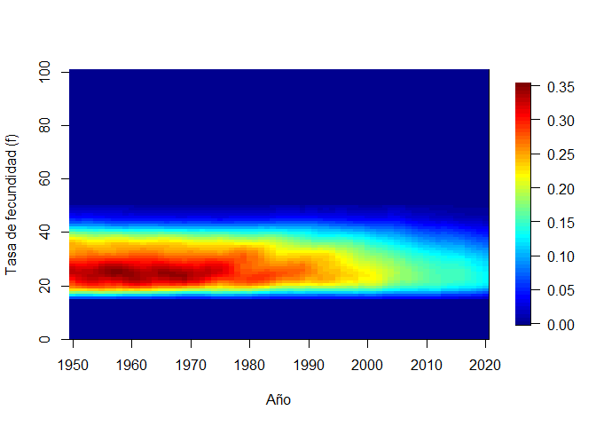<!-- -->

## 3\. La función `kin()`

`DemoKin` permite calcular el número de parientes de Focal y la
distribución etaria de estos parientes (bajo distintas premisas). Esto
incluye parientes vivos y muertos. La función `DemoKin::kin()` se
encarga de implemetar los modelos de parentesco. Este es un ejemplo, en
este caso asumiendo estabilidad demográfica (ver el parámetro
`time_invariant = TRUE`):

``` r
# First, get vectors for a given year
gt_surv_2015 <- gt_px[,"2015"]
gt_asfr_2015 <- gt_asfr[,"2015"]
# Run kinship models
gt_2015 <- kin(U = gt_surv_2015, f = gt_asfr_2015, time_invariant = TRUE)
```

### 3.1. Argumentos de la función

  - **U** numérico. Un vector o matriz con probabilidades de
    supervivencia, las edades son files y las columnas años (si es
    matriz).
  - **f** numérico. Igual que `U` pero para tasas de fecundidad
  - **time\_invariant** lógico. Asumir tasas estables? Default TRUE.
  - **output\_kin** caracter. Tipo de pariente a estimar: “m” para
    madre, “d” para hija, …

### 3.2. Tipos de parientes

El argumento `output_kin` usa códigos únicos para diferenciar tipos de
parientes. Note que los códigos en `DemoKin` son distintos a los usados
por Caswell (2019). Esta es la equivalencia de los códigos:

``` r
demokin_codes()
```

    ##    DemoKin Caswell                      Label
    ## 1      coa       t    Cousins from older aunt
    ## 2      cya       v  Cousins from younger aunt
    ## 3        d       a                   Daughter
    ## 4       gd       b             Grand-daughter
    ## 5      ggd       c       Great-grand-daughter
    ## 6      ggm       h          Great-grandmother
    ## 7       gm       g                Grandmother
    ## 8        m       d                     Mother
    ## 9      nos       p   Nieces from older sister
    ## 10     nys       q Nieces from younger sister
    ## 11      oa       r     Aunt older than mother
    ## 12      ya       s   Aunt younger than mother
    ## 13      os       m               Older sister
    ## 14      ys       n             Younger sister

### 3.4. Valor

`DemoKin::kin()` produce una lista con dos data frames: `kin_full` y
`kin_summary`.

``` r
str(gt_2015)
```

    ## List of 2
    ##  $ kin_full   : tibble[,7] [142,814 x 7] (S3: tbl_df/tbl/data.frame)
    ##   ..$ year     : logi [1:142814] NA NA NA NA NA NA ...
    ##   ..$ cohort   : logi [1:142814] NA NA NA NA NA NA ...
    ##   ..$ age_focal: int [1:142814] 0 1 2 3 4 5 6 7 8 9 ...
    ##   ..$ kin      : chr [1:142814] "d" "d" "d" "d" ...
    ##   ..$ age_kin  : int [1:142814] 0 0 0 0 0 0 0 0 0 0 ...
    ##   ..$ living   : num [1:142814] 0 0 0 0 0 0 0 0 0 0 ...
    ##   ..$ dead     : num [1:142814] 0 0 0 0 0 0 0 0 0 0 ...
    ##  $ kin_summary: tibble[,10] [1,414 x 10] (S3: tbl_df/tbl/data.frame)
    ##   ..$ age_focal     : int [1:1414] 0 0 0 0 0 0 0 0 0 0 ...
    ##   ..$ kin           : chr [1:1414] "coa" "cya" "d" "gd" ...
    ##   ..$ year          : logi [1:1414] NA NA NA NA NA NA ...
    ##   ..$ cohort        : logi [1:1414] NA NA NA NA NA NA ...
    ##   ..$ count_living  : num [1:1414] 0.635 0.22 0 0 0 ...
    ##   ..$ mean_age      : num [1:1414] 11.47 5.75 NaN NaN NaN ...
    ##   ..$ sd_age        : num [1:1414] 8.39 5.01 NaN NaN NaN ...
    ##   ..$ count_dead    : num [1:1414] 0 0 0 0 0 0 0 0 0 0 ...
    ##   ..$ count_cum_dead: num [1:1414] 0 0 0 0 0 0 0 0 0 0 ...
    ##   ..$ mean_age_lost : num [1:1414] NaN NaN NaN NaN NaN NaN NaN NaN NaN NaN ...

#### `kin_full`

Esta data frame contiene el número esperado de parientes por tipo de
pariente, año/cohorte, edad de Focal y edad del pariente.

``` r
head(gt_2015$kin_full)
```

    ## # A tibble: 6 x 7
    ##   year  cohort age_focal kin   age_kin living  dead
    ##   <lgl> <lgl>      <int> <chr>   <int>  <dbl> <dbl>
    ## 1 NA    NA             0 d           0      0     0
    ## 2 NA    NA             1 d           0      0     0
    ## 3 NA    NA             2 d           0      0     0
    ## 4 NA    NA             3 d           0      0     0
    ## 5 NA    NA             4 d           0      0     0
    ## 6 NA    NA             5 d           0      0     0

#### `kin_summary`

Esta es una data frame que resume el contenido de `kin_full`. Para
producirla, sumamos los valores a lo largo de todas las edades de los
parientes. Esto produce una data frame con el número esperado de
parientes por año/cohorte y edad de Focal (pero *no* por edad del
pariente). Así derivamos `kin_summary`:

``` r
kin_by_age_focal <- 
  gt_2015$kin_full %>% 
  group_by(cohort, kin, age_focal) %>% 
  summarise(count = sum(living)) %>% 
  ungroup()

# Check that they are identical (for living kin only here)

kin_by_age_focal %>% 
  select(cohort, kin, age_focal, count) %>% 
  identical(
    gt_2015$kin_summary %>% 
      select(cohort, kin, age_focal, count = count_living) %>% 
      arrange(cohort, kin, age_focal)
  )
```

    ## [1] TRUE

## 4\. Demostración: tamaño de redes familiares en Guatemala (poblaciones estables)

Asumamos una población femenina matrilineal sin migración cuyos miembros
experimentan las tasas de mortalidad y fecundidad de Guatemala
(reportadas para 2015) a lo largo de su vida (es decir, una población
estable). Preguntamos:

> Cómo podemos caracterizar la estructura familiar (redes de parentesco)
> de un miembro promedio de esta poblacion (llamada Focal)?

Para este ejercicio usaremos los datos de Guatemala que hemos venido
trabajando.

``` r
# First, get vectors for a given year
gt_surv_2015 <- gt_px[,"2015"]
gt_asfr_2015 <- gt_asfr[,"2015"]
# Run kinship models
gt_2015 <- kin(U = gt_surv_2015, f = gt_asfr_2015, time_invariant = TRUE)
```

### 4.1. Diagrama de parentesco al estilo ‘Keyfitz’

Usamos la función `plot_diagram` para visualizar el número implícito de
parientes de Focal cuando ella tiene 35 años (Keyfitz and Caswell 2005):

``` r
gt_2015$kin_summary %>% 
  filter(age_focal == 35) %>% 
  select(kin, count = count_living) %>% 
  plot_diagram(rounding = 2)
```

<!-- -->

### 4.2. Parentela viva

Ahora podemos mostrar la variación en el número esperado de hijas,
hermanas, primas, etc. de Focal a lo largo de su vida. Usamos la función
`DemoKin::rename_kin()` para mostrar los nombres de cada tipo de
pariente (en lugar de los códigos de parentesco).

``` r
gt_2015$kin_summary %>%
  rename_kin() %>% 
  ggplot() +
  geom_line(aes(age_focal, count_living))  +
  geom_vline(xintercept = 35, color=2)+
  theme_bw() +
  labs(x = "Edad de Focal") +
  facet_wrap(~kin)
```

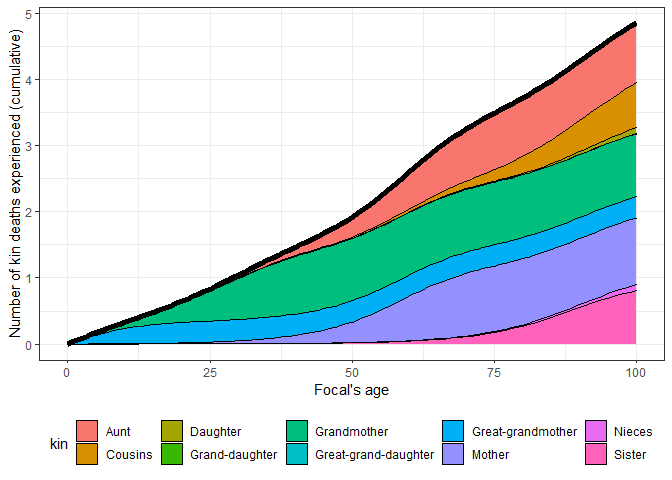<!-- -->

Podemos mostrar todo en una gráfica para visualizar el tamaño absoluto
de las redes familiares femeninas de Focal:

``` r
counts <- 
  gt_2015$kin_summary %>%
  group_by(age_focal) %>% 
  summarise(count = sum(count_living)) %>% 
  ungroup()

gt_2015$kin_summary %>%
  select(age_focal, kin, count_living) %>% 
  rename_kin(., consolidate_column = "count_living") %>%
  ggplot(aes(x = age_focal, y = count)) +
  geom_area(aes(fill = kin), colour = "black") +
  geom_line(data = counts, size = 2) +
  labs(x = "Edad de Focal", y = "Número de parientes con vida") +
  coord_cartesian(ylim = c(0, 8.5)) +
  theme_bw() +
  theme(legend.position = "bottom")
```

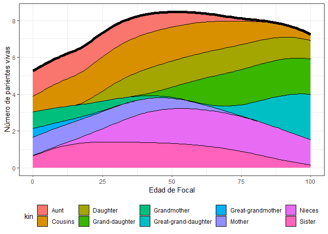<!-- -->

### 4.3. Distribución etaria de la parentela con vida

Qué edad tienen los parientes de Focal? Usamos la data frame `kin_full`
para mostrar la distribución etaria de los parientes de Focal a lo largo
de la vida de Focal. Por ejemplo, esta es la edad de los parientes de
Focal cuando ella tiene 35 años:

``` r
gt_2015$kin_full %>%
  DemoKin::rename_kin() %>%
  filter(age_focal == 35) %>%
  ggplot() +
  geom_line(aes(age_kin, living)) +
  geom_vline(xintercept = 35, color=2) +
  labs(y = "Número de parientes con vida") +
  theme_bw() +
  facet_wrap(~kin)
```

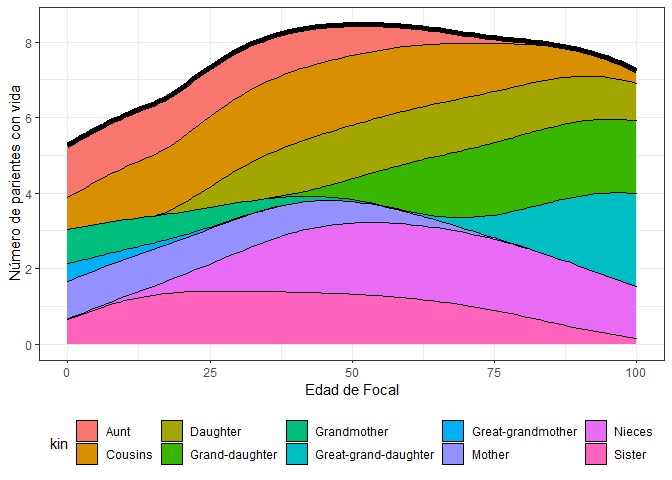<!-- -->

### 4.4. Pérdidas familiares

Nos hemos enfocados en parentela vivo, pero qué hay de los pariente que
han muerto ya? La función `kin` también incluye información sobre
muertes de parientes experimentadas por Focal.

Exploremos primero el número de pérdidas familiares que Focal
experimenta a cada edad de su vida. Es decir, el número de parientes
cuya pérdida es sufrida por Focal cuando Focal tiene 0,1,2,… años.

``` r
loss1 <- 
  gt_2015$kin_summary %>%
  filter(age_focal>0) %>%
  group_by(age_focal) %>% 
  summarise(count = sum(count_dead)) %>% 
  ungroup()

gt_2015$kin_summary %>%
  filter(age_focal>0) %>%
  group_by(age_focal, kin) %>% 
  summarise(count = sum(count_dead)) %>% 
  ungroup() %>% 
  rename_kin(., consolidate_column = "count") %>% 
  ggplot(aes(x = age_focal, y = count)) +
  geom_area(aes(fill = kin), colour = "black") +
  geom_line(data = loss1, size = 2) +
  labs(x = "Edad de Focal", y = "Numero de muertes en la familia experimentadas cada anio") +
  theme_bw() +
  theme(legend.position = "bottom")
```

    ## `summarise()` has grouped output by 'age_focal'. You can override using the
    ## `.groups` argument.

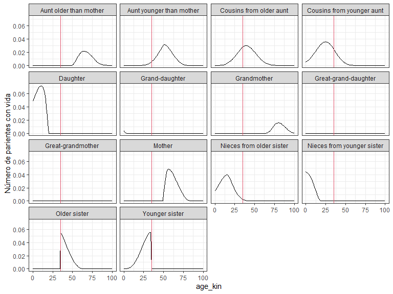<!-- -->

La suma de estos valores equivale al número acumulado de pérdidas
familiares experimentado por Focal cuando ella tiene 0,1,2,… años.

``` r
loss2 <- 
  gt_2015$kin_summary %>%
  group_by(age_focal) %>% 
  summarise(count = sum(count_cum_dead)) %>% 
  ungroup()


gt_2015$kin_summary %>%
  group_by(age_focal, kin) %>% 
  summarise(count = sum(count_cum_dead)) %>% 
  ungroup() %>% 
  rename_kin(., consolidate = "count") %>% 
  ggplot(aes(x = age_focal, y = count)) +
  geom_area(aes(fill = kin), colour = "black") +
  geom_line(data = loss2, size = 2) +
  labs(x = "Edad de Focal", y = "Number of kin deaths experienced (cumulative)") +
  theme_bw() +
  theme(legend.position = "bottom")
```

    ## `summarise()` has grouped output by 'age_focal'. You can override using the
    ## `.groups` argument.

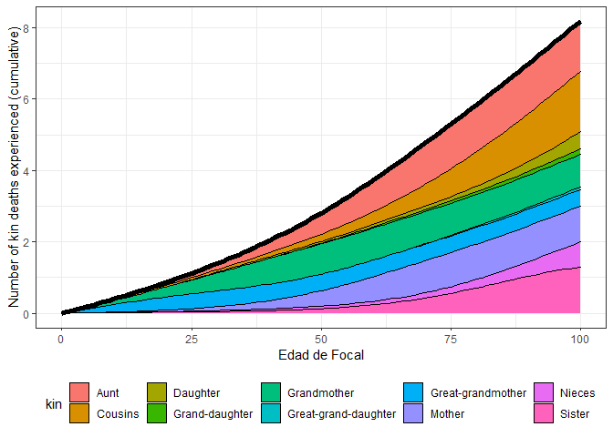<!-- -->

Por ejemplo, cuando Focal alcanza los 15, 50 y 65 años de edad, habrá
perdido un promedio de 0.6, 2.8, 4.2 parientes.

## 5\. Viñeta y extensiones

Para más detalles sobre `DemoKin`, incluyendo una extensión a
poblaciones no estables, y modelos multi-state, ver
`vignette("Reference", package = "DemoKin")`. Si la viñeta no carga,
intente instalar el paquete así:
`devtools::install_github("IvanWilli/DemoKin", build_vignettes = TRUE)`.

Para una descripción detallada de los modelos de parentesco, ver:

  - poblaciones estables (Caswell 2019),
  - modelos multistate (Caswell 2020),
  - poblaciones no estables (Caswell and Song 2021), and
  - modelos con dos sexos (Caswell 2022).

# Ejercicios

## Ejercicio 1: Parentesco en América Latina (poblaciones estables)

Cómo varían las estructuras de parentesco en varios paises de América
Latina? Que tan común es experimentar una pérdida familiar, y como se
distribuyen estas pérdidas familiares a lo largo de la vida?

Primero descargamos los datos necesarios usando el API de Naciones
Unidas:

``` r
# pick countries
countries <- c("Argentina", "Haiti", "Chile", "Guatemala")

# Year range

my_startyr   <- 2022
my_endyr     <- my_startyr

data <- get_UNWPP_inputs(
  countries = countries
  , my_startyr = my_startyr
  , my_endyr = my_endyr
  )
```

    ## [1] "Getting API ready..."
    ## [1] "Getting mortality data for Argentina, Haiti, Chile, Guatemala"
    ## [1] "Getting fertility data for Argentina, Haiti, Chile, Guatemala"

Corramos los modelos de parentesco para estos países, asumiendo una
población estable femenina.

``` r
period_kin <- 
  data %>%
  split(list(.$Location)) %>%
  map_df(function(X){
    print(paste(unique(X$Location), unique(X$Time)))
    kin(X$px, X$ASFR)$kin_summary %>%
      mutate(Location = unique(X$Location))
  })
```

    ## [1] "Argentina 2022"
    ## [1] "Chile 2022"
    ## [1] "Guatemala 2022"
    ## [1] "Haiti 2022"

Primero, definimos una función que nos permite aproximar parientes
masculinos y femeninos (usando “factores GKP”):

``` r
# A function to apply GKP factors to a female-only population to approximate kin counts for a two-sex population by multiplying daughters by 2, granddaughters by 4, etc. 
approx_two_sex <- function(df){
      factors <- c("coa" = 8, "cya" = 8, "d" = 2, "gd" = 4, "ggd" = 8, "ggm" = 8, "gm" = 4, "m" = 2, "nos" = 4, "nys" = 4, "oa" = 4, "ya" = 4, "os" = 2, "ys" = 2)

df <- as.data.frame(df)
factors_vec <- factors[df$kin]
df$count_living <- df$count_living*factors_vec
df$count_dead <- df$count_dead*factors_vec
drop <- c("mean_age", "sd_age", "count_cum_dead", "mean_age_lost")
print("Note: approx_two_sex only keeps columns with data on kin counts!")
print(paste0("Dropping columns: ", paste(drop, collapse = ", ")))
df[,!(names(df) %in% drop)]
}
```

Ahora podemos visualizar algunos la estructura de parentesco en estos
países. Comenzamos con la estructura familiar:

``` r
period_kin %>% 
  approx_two_sex() %>% 
  select(age_focal, kin, count = count_living, Location) %>% 
  rename_kin2(consolidate_column = "count") %>%
  ggplot(aes(x = age_focal, y = count)) +
  geom_area(aes(fill = kin), colour = "black") +
  labs(x = "Edad de Focal", y = "Número de parientes con vida") +
  facet_wrap(~Location) +
  theme_bw() +
  theme(legend.position = "bottom")
```

    ## [1] "Note: approx_two_sex only keeps columns with data on kin counts!"
    ## [1] "Dropping columns: mean_age, sd_age, count_cum_dead, mean_age_lost"

    ## `summarise()` has grouped output by 'age_focal', 'kin'. You can override using
    ## the `.groups` argument.

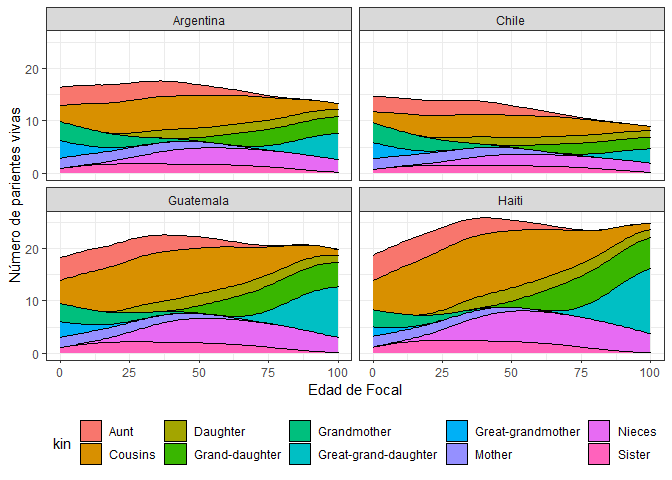<!-- -->

Cuántas pérdidas familiares experimenta una persona a la edad exacta ‘x’
en distintos paises de LATAM?

``` r
exact_death <- 
  period_kin %>% 
  approx_two_sex() %>% 
    rename_kin2(consolidate_column = "count_dead")
```

    ## [1] "Note: approx_two_sex only keeps columns with data on kin counts!"
    ## [1] "Dropping columns: mean_age, sd_age, count_cum_dead, mean_age_lost"

    ## `summarise()` has grouped output by 'age_focal', 'kin'. You can override using
    ## the `.groups` argument.

``` r
exact_death %>% 
  ggplot(aes(x = age_focal, y = count)) +
  geom_area(aes(fill = kin), colour = "black") +
  facet_wrap(~Location) +
  labs(x = "Edad de Focal", y = "Perdidas familiares experimentadas en cada edad") +
  theme_bw() +
  theme(legend.position = "bottom")
```

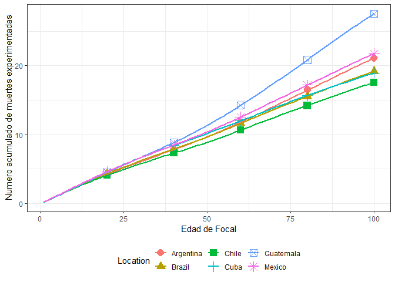<!-- -->

Para visualiar el número acumulado de pérdidas familiares:

``` r
cum_death <-
  period_kin %>% 
  approx_two_sex() %>% 
  # We estimate the cummulative number of kin deaths by hand
  group_by(Location, kin) %>% 
  arrange(age_focal) %>% 
  mutate(count_cum_dead = cumsum(count_dead)) %>% 
  ungroup() %>% 
  rename_kin2(consolidate_column = "count_cum_dead")
```

    ## [1] "Note: approx_two_sex only keeps columns with data on kin counts!"
    ## [1] "Dropping columns: mean_age, sd_age, count_cum_dead, mean_age_lost"

    ## `summarise()` has grouped output by 'age_focal', 'kin'. You can override using
    ## the `.groups` argument.

``` r
cum_death %>% 
  ggplot(aes(x = age_focal, y = count)) +
  geom_area(aes(fill = kin), colour = "black") +
  facet_wrap(~Location) +
  labs(x = "Edad de Focal", y = "Numero acumulado de perdidas familiares") +
  theme_bw() +
  theme(legend.position = "bottom")
```

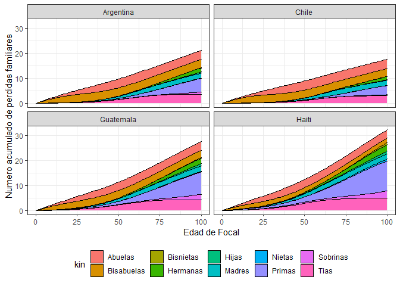<!-- -->

Finalmente, graficamos los resultados sin diferenciar el numero de
parientes y comparamos los resultados para cada pais en una misma
gráfica:

``` r
exact_line <-
  exact_death %>% 
  filter(age_focal>0) %>%
  group_by(Location, age_focal) %>% 
  summarise(count = sum(count)) %>% 
  ungroup() %>% 
  mutate(variable = "A cada edad")
```

    ## `summarise()` has grouped output by 'Location'. You can override using the
    ## `.groups` argument.

``` r
cum_line <-
  cum_death %>% 
  filter(age_focal>0) %>%
  group_by(Location, age_focal) %>% 
  summarise(count = sum(count)) %>% 
  ungroup() %>% 
  mutate(variable = "Acumulado")
```

    ## `summarise()` has grouped output by 'Location'. You can override using the
    ## `.groups` argument.

``` r
exact_line %>% 
  bind_rows(cum_line) %>% 
  ggplot(aes(x = age_focal, y = count, colour = Location, shape = Location)) +
  geom_point(
    size = 4
    , data = . %>% filter(age_focal %in% seq(0,100,20))
    ) +
  geom_line(size = 1) +
  labs(x = "Edad de Focal", y = "Numero de perdidas familiares experimentadas") +
  facet_wrap(~variable, scales = "free") +
  theme_bw() +
  theme(legend.position = "bottom")
```

<!-- -->

## Ejercicio 2: Abuelos en poblaciones no estables

``` r
# pick countries
countries <- c("Argentina", "Haiti", "Chile", "Guatemala")

# Year range

my_startyr   <- 1950
my_endyr     <- 2020

data <- get_UNWPP_inputs(
  countries = countries
  , my_startyr = my_startyr
  , my_endyr = my_endyr
  )
```

    ## [1] "Getting API ready..."
    ## [1] "Getting mortality data for Argentina, Haiti, Chile, Guatemala"
    ## [1] "Getting fertility data for Argentina, Haiti, Chile, Guatemala"

Explorar cambios a traves del tiempo en una perspectiva de periodo. En
este ejemplo, vamos a usar un modelo que no asume estabilidad de tasas
demográficas. Los modelos “dinámicos” (es decir, no estables) tardan más
tiempo en correr.

``` r
# period data for decennial years
period_kin_temp <- 
  data %>%
  split(list(.$Location)) %>%
  map_df(function(X){
    print(unique(X$Location))
    U <-
      X %>%
      select(Time, age, px) %>%
      pivot_wider(names_from = Time, values_from = px) %>%
      select(-age) %>% as.matrix()
    f <- X %>%
      select(Time, age, ASFR) %>%
      mutate(ASFR = ASFR/1000) %>% 
      pivot_wider(names_from = Time, values_from = ASFR) %>%
      select(-age) %>% as.matrix()
    kin(U, f, time_invariant = FALSE, output_kin = c("gm"), output_period = seq(1950, 2020, 10))$kin_summary %>%
      mutate(Location = unique(X$Location),  .before = 1)
  })
```

    ## [1] "Argentina"

    ## Stable assumption was made for calculating pi on each year because no input data.

    ## Warning: replacing previous import 'lifecycle::last_warnings' by
    ## 'rlang::last_warnings' when loading 'hms'

    ## Assuming stable population before 1950.

    ## [1] "Chile"

    ## Stable assumption was made for calculating pi on each year because no input data.

    ## Assuming stable population before 1950.

    ## [1] "Guatemala"

    ## Stable assumption was made for calculating pi on each year because no input data.
    ## Assuming stable population before 1950.

    ## [1] "Haiti"

    ## Stable assumption was made for calculating pi on each year because no input data.
    ## Assuming stable population before 1950.

``` r
# Aproximemos valores para dos sexos usando GKP factors:

period_kin <- 
  period_kin_temp %>% 
    approx_two_sex()
```

    ## [1] "Note: approx_two_sex only keeps columns with data on kin counts!"
    ## [1] "Dropping columns: mean_age, sd_age, count_cum_dead, mean_age_lost"

Ahora podemos graficar cambio a travel del tiempo, por ejemplo, en el
numero promedio de abuelos que tiene un niño recién nacido:

``` r
period_kin %>% 
  filter(age_focal %in% 0) %>% 
  select(Location, kin, year, age_focal, count_living) %>% 
  ggplot(aes(year,count_living,color=Location, shape = Location)) +
  geom_line(size = 1) + 
  geom_point(size = 4) +
  labs(x = "Año", y = "Número de abuelos vivos al nacer") +
  theme_bw() +
  theme(legend.position = "bottom") 
```

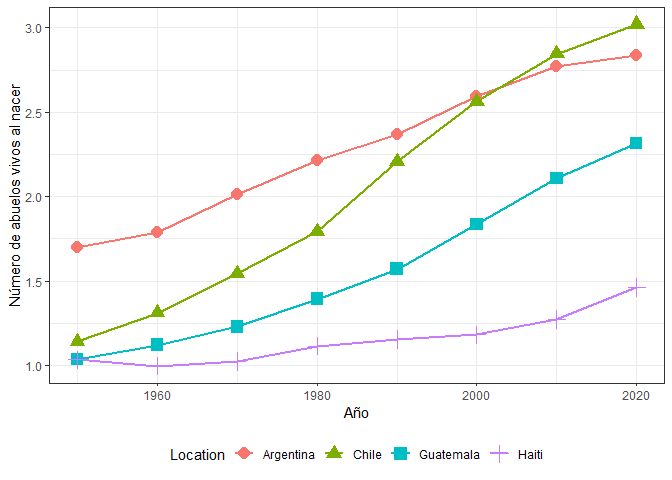<!-- -->

Finalmente, que tan común es perder a un abuelo y a qué edad se
experimenta la pérdida de un abuelo en los distintos paises? Cómo ha
cambiado esto a través del tiempo?

``` r
period_kin %>% 
  filter(
    between(age_focal, 1, 50)
    , year %in% c(1950, 1980, 2020)
    ) %>% 
  mutate(year = as.factor(year)) %>% 
  ggplot(aes(x = age_focal, y = count_dead, colour = year, group = year, shape = year)) +
  geom_line(size = 1) + 
  geom_point(size = 4, data = . %>% filter(age_focal %in% c(1, seq(0, 50, 10)))) +
  labs(x = "Edad de Focal", y = "Número de abuelos que mueren a cada edad", shape = "Año", colour = "Año") +
  facet_wrap(~Location) +
  theme_bw() +
  theme(legend.position = "bottom") 
```

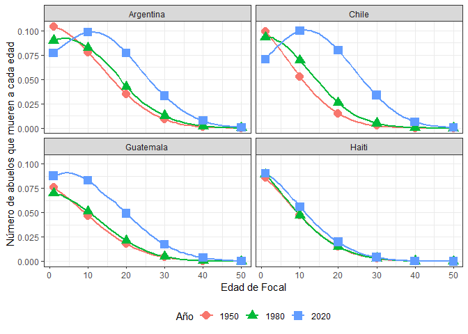<!-- -->

## Ejercicio 3. Parientes vivos y muertos

Use `DemoKin` (asumiendo una población estable femenina con las tasas
argentinas de 2010) para explorar el número de parientes vivos y muertos
de Focal (un miembro promedio de la población).

**Responda**: Cuántos hijos tiene Focal a sus 65 años?

``` r
# Escriba su código aquí
```

**Responda**: Cuántos hijos ha perdido Focal al cumplir 65 años (en
total)?

``` r
# Escriba su código aquí
```

## Ejercicio 4. Edad promedio de los parientes

La función `DemoKin::kin` provee información sobre la edad promedio de
los parientes de Focal (en las columnas `kin_summary$mean_age` y
`kin_summary$$sd_age`). Por ejemplo, esta es la edad promedio de las
hermanas de Focal:

``` r
gt_2015$kin_summary %>%  
  filter(kin %in% c("os", "ys")) %>% 
  rename_kin() %>% 
  select(kin, age_focal, mean_age, sd_age) %>% 
  pivot_longer(mean_age:sd_age) %>% 
  ggplot(aes(x = age_focal, y = value, colour = kin)) +
  geom_line() +
  facet_wrap(~name, scales = "free") +
  labs(y = "Edad promedio de hermanas") +
  theme_bw()
```

    ## Warning: Removed 1 row(s) containing missing values (geom_path).

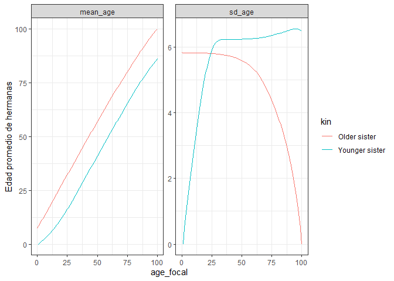<!-- -->

**Instrucciones**

Use DemoKin, asumiendo una población estable femenina con las tasas
argentinas de 2010. Estime la edad promedio y la desviación estándar de
las hermanas de Focal **a mano** (es decir, a partir de los datos en la
data frame `kin_full`). Grafique por separado para (1) hermanas menores
y mayores y (2) para todas las hermanas juntas.

Primero, la edad promedio de hermanas menores y mayores por separado:

``` r
# Escriba su código aquí
```

Segundo, la edad promedio de todas las hermanas sin importar su paridad:

``` r
# Escriba su código aquí
```

## Ejercicio 5. Madres

Cuál es la probabilidad de que Focal (una mujer Argentina promedio)
tenga una madre con vida, a lo largo de la vida de Focal?

**Instrucciones**

Use DemoKin, asumiendo una población estable femenina con las tasas
argentinas de 2010, para obtener
"), la
probabilidad de que Focal tenga una madre con vida a la edad
 de Focal en una
población estable. Si Focal sobrevive,
}") es análoga a la probabilidad de sobrevivor en una tabla de
mortalidad: deber ser 1 cuando
 es 0 (la madre esta
viva al dar a luz) y luego disminuye de forma monotónica hasta llegar a
0.

**Responda:** Cuál es la probabilidad de que la madre de Focal sobreviva
hasta el cumpleaños 70 de Focal?

``` r
# Escriba su código aquí
```

## Ejercicio 6. Generación Sandwich

La ‘Generación Sandwich’ se refiere a personas que se encuentran
‘ensanguchadas’ entre padres mayores e hijos jóvenes que requiren
cuidado y atención. Asumimos que esto representa una doble carga de
cuidado hacia miembros de ambas generaciones. En demografía, este es un
proceso intergeneracional que depende de la posición genealógica de un
individuo respecto a la generación superior e inferior.

En este ejercicio, una persona estará ensanguchada si tiene al menos un
hijo de edad  o menor
y (al mismo tiempo) un padre que morirá en los próximos
 años.
Alburez‐Gutierrez, Mason, y Zagheni (2021) defineron la probabilidad
de que Focal estuviera ensanguchada a la edad
 en una población
estable así:

  
![&#10;S(a) = \\underbrace{\\left(1 - \\prod\_{x=1}^{15} \[1 -
m\_{a-x})\] \\right)}\_{\\substack{\\text{fecundidad en los}\\\\
\\text{$15$ anios antes de edad 'a'}}} \\times
\\underbrace{M\_1(a)}\_{\\substack{\\text{Prob. que madre de Focal}\\\\
\\text{este viva cuando Focal tiene 'a' anios}}} \\times
\\underbrace{\\left(1-
\\frac{M\_1(a+5)}{M\_1(a)}\\right)}\_{\\substack{\\text{Prob. que madre
de Focal}\\\\ \\text{muera en proximos $5$ anios}}}
&#10;](https://latex.codecogs.com/png.latex?%0AS%28a%29%20%3D%20%5Cunderbrace%7B%5Cleft%281%20-%20%5Cprod_%7Bx%3D1%7D%5E%7B15%7D%20%5B1%20-%20m_%7Ba-x%7D%29%5D%20%5Cright%29%7D_%7B%5Csubstack%7B%5Ctext%7Bfecundidad%20en%20los%7D%5C%5C%20%5Ctext%7B%2415%24%20anios%20antes%20de%20edad%20%27a%27%7D%7D%7D%20%5Ctimes%20%5Cunderbrace%7BM_1%28a%29%7D_%7B%5Csubstack%7B%5Ctext%7BProb.%20que%20madre%20de%20Focal%7D%5C%5C%20%5Ctext%7Beste%20viva%20cuando%20Focal%20tiene%20%27a%27%20anios%7D%7D%7D%20%5Ctimes%20%20%5Cunderbrace%7B%5Cleft%281-%20%20%5Cfrac%7BM_1%28a%2B5%29%7D%7BM_1%28a%29%7D%5Cright%29%7D_%7B%5Csubstack%7B%5Ctext%7BProb.%20que%20madre%20de%20Focal%7D%5C%5C%20%5Ctext%7Bmuera%20en%20proximos%20%245%24%20anios%7D%7D%7D%20%20%20%20%0A
"
S(a) = \\underbrace{\\left(1 - \\prod_{x=1}^{15} [1 - m_{a-x})] \\right)}_{\\substack{\\text{fecundidad en los}\\\\ \\text{$15$ anios antes de edad 'a'}}} \\times \\underbrace{M_1(a)}_{\\substack{\\text{Prob. que madre de Focal}\\\\ \\text{este viva cuando Focal tiene 'a' anios}}} \\times  \\underbrace{\\left(1-  \\frac{M_1(a+5)}{M_1(a)}\\right)}_{\\substack{\\text{Prob. que madre de Focal}\\\\ \\text{muera en proximos $5$ anios}}}    
")  

donde

  -  es la fecunidad en la edad
     y
  - ")
    es la probabilidad de tener una madre viva a la edad
     en una población
    estable.

Este cálculo se refiere a una mujer promedio en una población femenina
estable e ignora la mortalidad infantil.

**Instrucciones**

Use DemoKin para estimar la probabilidad de que Focal esté ensanguchada,
"), entre las
edades 15 y 70. Asuma una población femenina estable usando las tasas de
Argentina.

**Responda:** A qué edad es más probable que Focal esté ensanguchada?

``` r
# Escriba su código aquí
```

## Session info

``` r
sessionInfo()
```

    ## R version 4.0.2 (2020-06-22)
    ## Platform: x86_64-w64-mingw32/x64 (64-bit)
    ## Running under: Windows 10 x64 (build 19044)
    ## 
    ## Matrix products: default
    ## 
    ## locale:
    ## [1] LC_COLLATE=English_United Kingdom.1252 
    ## [2] LC_CTYPE=English_United Kingdom.1252   
    ## [3] LC_MONETARY=English_United Kingdom.1252
    ## [4] LC_NUMERIC=C                           
    ## [5] LC_TIME=English_United Kingdom.1252    
    ## 
    ## attached base packages:
    ## [1] grid      stats     graphics  grDevices utils     datasets  methods  
    ## [8] base     
    ## 
    ## other attached packages:
    ## [1] fields_11.6     spam_2.6-0      dotCall64_1.0-1 ggplot2_3.3.3  
    ## [5] purrr_0.3.4     tidyr_1.1.3     dplyr_1.0.5     DemoKin_1.0.0  
    ## 
    ## loaded via a namespace (and not attached):
    ##  [1] highr_0.8         pillar_1.5.1      compiler_4.0.2    prettyunits_1.1.1
    ##  [5] progress_1.2.2    tools_4.0.2       digest_0.6.28     evaluate_0.17    
    ##  [9] lifecycle_1.0.0   tibble_3.1.0      gtable_0.3.0      pkgconfig_2.0.3  
    ## [13] rlang_1.0.2       igraph_1.2.6      cli_3.2.0         DBI_1.1.1        
    ## [17] rstudioapi_0.13   yaml_2.2.1        xfun_0.21         fastmap_1.1.0    
    ## [21] withr_2.5.0       stringr_1.4.0     knitr_1.31        hms_1.0.0        
    ## [25] maps_3.3.0        generics_0.1.0    vctrs_0.4.1       tidyselect_1.1.0 
    ## [29] glue_1.6.2        R6_2.5.0          fansi_0.4.2       rmarkdown_2.7    
    ## [33] farver_2.1.0      magrittr_2.0.1    scales_1.1.1      ellipsis_0.3.2   
    ## [37] htmltools_0.5.2   assertthat_0.2.1  colorspace_2.0-0  labeling_0.4.2   
    ## [41] utf8_1.2.1        stringi_1.5.3     munsell_0.5.0     crayon_1.4.1

## References

<div id="refs" class="references">

<div id="ref-alburezgutierrez_sandwich_2021">

Alburez‐Gutierrez, Diego, Carl Mason, and Emilio Zagheni. 2021. “The
‘Sandwich Generation’ Revisited: Global Demographic Drivers of Care
Time Demands.” *Population and Development Review* 47 (4): 997–1023.
<https://doi.org/10.1111/padr.12436>.

</div>

<div id="ref-caswell_formal_2019">

Caswell, Hal. 2019. “The Formal Demography of Kinship: A Matrix
Formulation.” *Demographic Research* 41 (September): 679–712.
<https://doi.org/10.4054/DemRes.2019.41.24>.

</div>

<div id="ref-caswell_formal_2020">

———. 2020. “The Formal Demography of Kinship II: Multistate Models,
Parity, and Sibship.” *Demographic Research* 42 (June): 1097–1146.
<https://doi.org/10.4054/DemRes.2020.42.38>.

</div>

<div id="ref-caswell_formal_2022">

———. 2022. “The Formal Demography of Kinship IV: Two-Sex Models and
Their Approximations.” *Demographic Research* 47 (September): 359–96.
<https://doi.org/10.4054/DemRes.2022.47.13>.

</div>

<div id="ref-caswell_formal_2021">

Caswell, Hal, and Xi Song. 2021. “The Formal Demography of Kinship. III.
Kinship Dynamics with Time-Varying Demographic Rates.” *Demographic
Research* 45: 517–46.

</div>

<div id="ref-Keyfitz2005">

Keyfitz, Nathan, and Hal Caswell. 2005. *Applied Mathematical
Demography*. New York: Springer.

</div>

</div>
