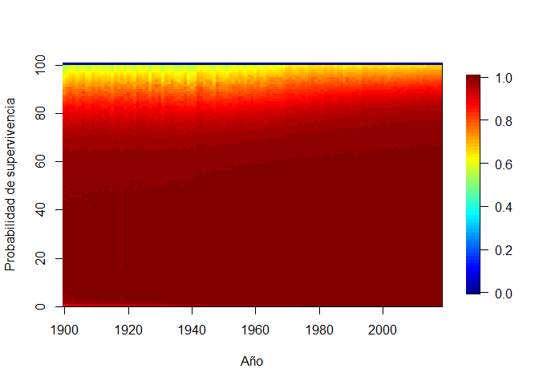
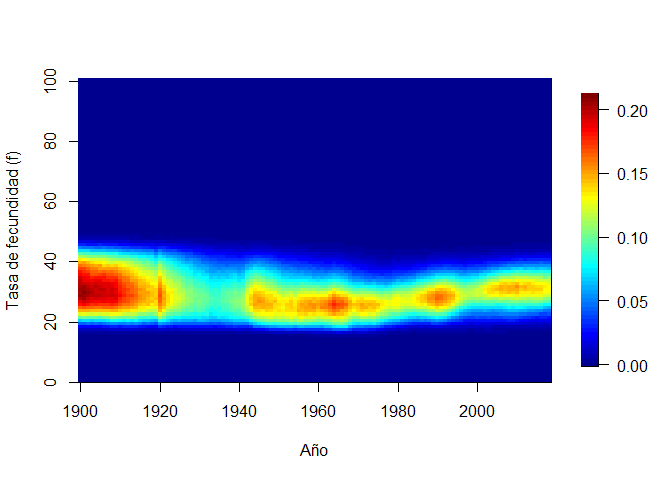
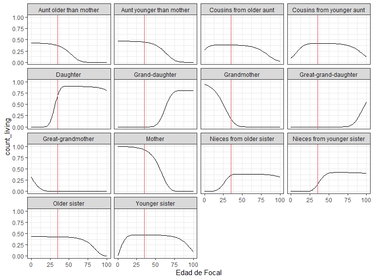
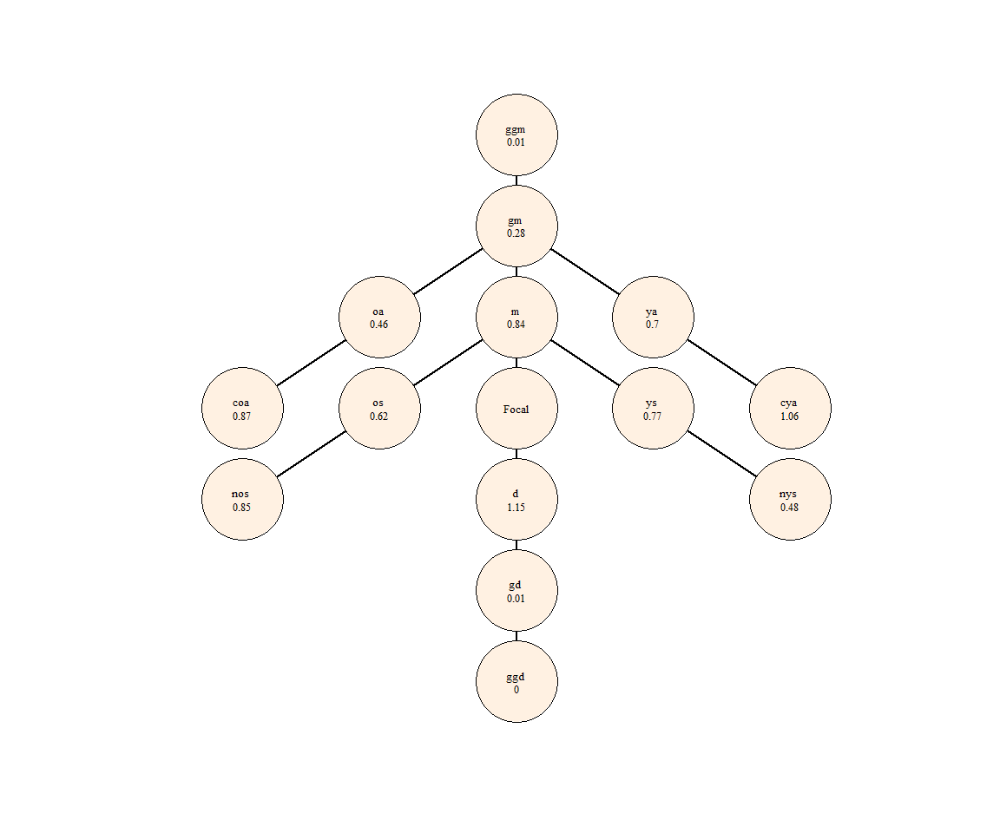

Demografía del parentesco: introducción a temas y método
================
Facilitador: Diego Alburez-Gutierrez (MPIDR);
Pre-evento del X Congreso ALAP; Valparaíso, Chile - 6 Dic 2022

  - [1. Instalación](#1-instalación)
  - [2. Bases de datos incluidas en el
    paquete](#2-bases-de-datos-incluidas-en-el-paquete)
  - [3. La función `kin()`](#3-la-función-kin)
  - [4. Ejemplo: número de parientes en poblaciones
    estables](#4-ejemplo-número-de-parientes-en-poblaciones-estables)
  - [5. Viñeta y extensiones](#5-viñeta-y-extensiones)
  - [6. Ejercicios](#6-ejercicios)
  - [8. Session info](#8-session-info)


# 1\. Instalación

Instale el paquete `DemoKin` [desde
GitHub](https://github.com/IvanWilli/DemoKin) (puede tomar \~1 minuto).
Hicimos algunos cambios al paquete `DemoKin` antes de este taller. Si
había instalado el paquete con anterioridad, desinstalelo y vuelva a
instalarlo.

``` r
# remove.packages("DemoKin")
# install.packages("devtools")
devtools::install_github("IvanWilli/DemoKin", build_vignettes = TRUE)
```

Cargue algunos paquetes:

``` r
library(DemoKin)
library(dplyr)
library(tidyr)
library(ggplot2)
library(fields)
```

# 2\. Bases de datos incluidas en el paquete

El paquete `DemoKin` incluye datos de Suecia como ejemplo.  
The data comes from the [Human Mortality
Database](https://www.mortality.org/) and [Human Fertility
Database](https://www.humanfertility.org/). These datasets were loaded
using the`DemoKin::get_HMDHFD` function.

### 2.1. `swe_px` matrix; survival probabilities by age (DemoKin’s *U* argument)

Así se ven los datos:

``` r
data("swe_px", package="DemoKin")

swe_px[1:4, 1:4]
```

    ##      1900    1901    1902    1903
    ## 0 0.91060 0.90673 0.92298 0.91890
    ## 1 0.97225 0.97293 0.97528 0.97549
    ## 2 0.98525 0.98579 0.98630 0.98835
    ## 3 0.98998 0.98947 0.99079 0.99125

Grafiquemos sobre tiempo y edad:

``` r
image.plot(
  x = as.numeric(colnames(swe_px))
  , y = 0:nrow(swe_px)
  , z = t(as.matrix(swe_px))
  , xlab = "Año"
  , ylab = "Probabilidad de supervivencia"
  )
```

<!-- -->

### 2.2. `swe_asfr` matrix; age specific fertility rate (DemoKin’s *f* argument)

Así se ven los datos:

``` r
data("swe_asfr", package="DemoKin")

swe_asfr[15:20, 1:4]
```

    ##       1900    1901    1902    1903
    ## 14 0.00013 0.00006 0.00008 0.00008
    ## 15 0.00053 0.00054 0.00057 0.00057
    ## 16 0.00275 0.00319 0.00322 0.00259
    ## 17 0.00932 0.00999 0.00965 0.00893
    ## 18 0.02328 0.02337 0.02347 0.02391
    ## 19 0.04409 0.04357 0.04742 0.04380

Grafiquemos sobre tiempo y edad:

``` r
image.plot(
  x = as.numeric(colnames(swe_asfr))
  , y = 0:nrow(swe_asfr)
  , z = t(as.matrix(swe_asfr))
  , xlab = "Año"
  , ylab = "Tasa de fecundidad (f)"
  )
```

<!-- -->

# 3\. La función `kin()`

`DemoKin` puede usarse para estimar el número de parientes de Focal y su
distribución etaria acorde a un número de premisas. Esto incluye
parientes vivos y muertos. La función `DemoKin::kin()` se encarga de
implemetar los modelos de parentesco. Este es un ejemplo, en este caso,
asumiendo estabilidad demográfica:

``` r
# First, get vectors for a given year
swe_surv_2015 <- DemoKin::swe_px[,"2015"]
swe_asfr_2015 <- DemoKin::swe_asfr[,"2015"]
# Run kinship models
swe_2015 <- kin(U = swe_surv_2015, f = swe_asfr_2015, time_invariant = TRUE)
```

## 3.1. Argumentos

  - **U** numérico Un vector o matriz con probabilidades de
    supervivencia, las edades son files y las columnas años (si es
    matriz).
  - **f** numérico. Igual que U pero para tasas de fecundidad
  - **time\_invariant** lógico. Asumir tasas estables. Default TRUE.
  - **output\_kin** caracter. tipo de pariente que estimar: “m” para
    madre, “d” para hija, …

## 3.2. Tipos de parientes

El arugmento `output_kin` usa códigos únicos para identificar tipos de
parientes. Note que los códigos en `DemoKin` son distintos a los usados
por Caswell (2019). Esta es la equivalencia de los códigos:

``` r
demokin_codes()
```

    ##    DemoKin Caswell                      Label
    ## 1      coa       t    Cousins from older aunt
    ## 2      cya       v  Cousins from younger aunt
    ## 3        d       a                   Daughter
    ## 4       gd       b             Grand-daughter
    ## 5      ggd       c       Great-grand-daughter
    ## 6      ggm       h          Great-grandmother
    ## 7       gm       g                Grandmother
    ## 8        m       d                     Mother
    ## 9      nos       p   Nieces from older sister
    ## 10     nys       q Nieces from younger sister
    ## 11      oa       r     Aunt older than mother
    ## 12      ya       s   Aunt younger than mother
    ## 13      os       m               Older sister
    ## 14      ys       n             Younger sister

## 3.4. Valor

`DemoKin::kin()` produce una lista con dos data frames: `kin_full` y
`kin_summary`.

``` r
str(swe_2015)
```

    ## List of 2
    ##  $ kin_full   : tibble[,7] [142,814 x 7] (S3: tbl_df/tbl/data.frame)
    ##   ..$ year     : logi [1:142814] NA NA NA NA NA NA ...
    ##   ..$ cohort   : logi [1:142814] NA NA NA NA NA NA ...
    ##   ..$ age_focal: int [1:142814] 0 1 2 3 4 5 6 7 8 9 ...
    ##   ..$ kin      : chr [1:142814] "d" "d" "d" "d" ...
    ##   ..$ age_kin  : int [1:142814] 0 0 0 0 0 0 0 0 0 0 ...
    ##   ..$ living   : num [1:142814] 0 0 0 0 0 0 0 0 0 0 ...
    ##   ..$ dead     : num [1:142814] 0 0 0 0 0 0 0 0 0 0 ...
    ##  $ kin_summary: tibble[,10] [1,414 x 10] (S3: tbl_df/tbl/data.frame)
    ##   ..$ age_focal     : int [1:1414] 0 0 0 0 0 0 0 0 0 0 ...
    ##   ..$ kin           : chr [1:1414] "coa" "cya" "d" "gd" ...
    ##   ..$ year          : logi [1:1414] NA NA NA NA NA NA ...
    ##   ..$ cohort        : logi [1:1414] NA NA NA NA NA NA ...
    ##   ..$ count_living  : num [1:1414] 0.2752 0.0898 0 0 0 ...
    ##   ..$ mean_age      : num [1:1414] 8.32 4.05 NaN NaN NaN ...
    ##   ..$ sd_age        : num [1:1414] 6.14 3.68 NaN NaN NaN ...
    ##   ..$ count_dead    : num [1:1414] 0 0 0 0 0 0 0 0 0 0 ...
    ##   ..$ count_cum_dead: num [1:1414] 0 0 0 0 0 0 0 0 0 0 ...
    ##   ..$ mean_age_lost : num [1:1414] NaN NaN NaN NaN NaN NaN NaN NaN NaN NaN ...

### `kin_full`

Esta data frame contiene el número esperado de parientes por tipo de
pariente, año/cohorte, edad de Focal y edad del pariente.

``` r
head(swe_2015$kin_full)
```

    ## # A tibble: 6 x 7
    ##   year  cohort age_focal kin   age_kin living  dead
    ##   <lgl> <lgl>      <int> <chr>   <int>  <dbl> <dbl>
    ## 1 NA    NA             0 d           0      0     0
    ## 2 NA    NA             1 d           0      0     0
    ## 3 NA    NA             2 d           0      0     0
    ## 4 NA    NA             3 d           0      0     0
    ## 5 NA    NA             4 d           0      0     0
    ## 6 NA    NA             5 d           0      0     0

### `kin_summary`

Esta es una data frame que resume el contenido de `kin_full`. Para
producirla, sumamos los valores a traves de todas las edades de los
parientes. Esto produce una data frame con el número esperado de
parientes por año/cohorte y edad de Focal (pero *no* por edad del
pariente). Así derivamos `kin_summary`:

``` r
kin_by_age_focal <- 
  swe_2015$kin_full %>% 
  group_by(cohort, kin, age_focal) %>% 
  summarise(count = sum(living)) %>% 
  ungroup()

# Check that they are identical (for living kin only here)

kin_by_age_focal %>% 
  select(cohort, kin, age_focal, count) %>% 
  identical(
    swe_2015$kin_summary %>% 
      select(cohort, kin, age_focal, count = count_living) %>% 
      arrange(cohort, kin, age_focal)
  )
```

    ## [1] TRUE

# 4\. Ejemplo: número de parientes en poblaciones estables

Seguimos a Caswell (2019), al asumir una población femenina matrilineal
cerradaen la cual todas experimentan las tasas de mortalidad y
fecundidad en Argentina a lo largo de su vida. Preguntamos:

> Cömo podemos caracterizar la estructura familiar (redes de parentesco)
> de un miembro promedio de esta poblacion (llamada Focal)?

Para este ejercicio usaremos los datos de Argentina que hemos venido
trabajando.

``` r
# First, get vectors for a given year
swe_surv_2015 <- DemoKin::swe_px[,"2015"]
swe_asfr_2015 <- DemoKin::swe_asfr[,"2015"]
# Run kinship models
swe_2015 <- kin(U = swe_surv_2015, f = swe_asfr_2015, time_invariant = TRUE)
```

## 4.1. Diagrama de parentesco al estilo ‘Keyfitz’

Usamos la función `plot_diagram` para visualizar el número implícito de
parientes de Focal cuando ella tiene 35 años (Keyfitz and Caswell 2005):

``` r
swe_2015$kin_summary %>% 
  filter(age_focal == 35) %>% 
  select(kin, count = count_living) %>% 
  plot_diagram(rounding = 2)
```

<!-- -->

## 4.2. Parentela viva

Ahora podemos mostrar la variación en el número esperado de hijas,
hermanas, primas, etc. de Focal a lo largo de su vida. Usamos la función
`DemoKin::rename_kin()` para mostrar los nombres de cada tipo de
pariente.

``` r
swe_2015$kin_summary %>%
  rename_kin() %>% 
  ggplot() +
  geom_line(aes(age_focal, count_living))  +
  geom_vline(xintercept = 35, color=2)+
  theme_bw() +
  labs(x = "Edad de Focal") +
  facet_wrap(~kin)
```

<!-- -->

Podemos mostrar todo en una gráfica para visualizar el tamaño absoluto
de las redes familiares de Focal:

``` r
counts <- 
  swe_2015$kin_summary %>%
  group_by(age_focal) %>% 
  summarise(count = sum(count_living)) %>% 
  ungroup()

swe_2015$kin_summary %>%
  select(age_focal, kin, count_living) %>% 
  rename_kin(., consolidate_column = "count_living") %>%
  ggplot(aes(x = age_focal, y = count)) +
  geom_area(aes(fill = kin), colour = "black") +
  geom_line(data = counts, size = 2) +
  labs(x = "Edad de Focal", y = "Número de parientes vivas") +
  coord_cartesian(ylim = c(0, 6)) +
  theme_bw() +
  theme(legend.position = "bottom")
```

<!-- -->

## 4.3. Distribución etaria de la parentela con vida

Qué edad tienen los parientes de Focal? Usamos la data frame `kin_full`
para mostrar la distribución etaria de los parientes de Focal a lo largo
de la vida de Focal. Por ejemplo, esta es la edad de los parientes de
Focal cuando ella tiene 35 años:

``` r
swe_2015$kin_full %>%
DemoKin::rename_kin() %>%
filter(age_focal == 35) %>%
ggplot() +
geom_line(aes(age_kin, living)) +
geom_vline(xintercept = 35, color=2) +
labs(y = "Número de parientes vivas") +
theme_bw() +
facet_wrap(~kin)
```

<!-- -->

## 4.4. Parientes muertos

Nos hemos enfocados en parentela vivo, pero qué hay de los pariente que
han muerto ya? La función `kin` tmabién incluye información sobre
muertes de parientes experimentadas por Focal.

Exploremos primero el número de muertes de parientes que Focal
experimenta en cada edad de su vida. Es decir, el número de parientes
cuya muerte es sufrida por Focal cuando Focal tiene 0,1,2,… años.

``` r
loss1 <- 
  swe_2015$kin_summary %>%
  filter(age_focal>0) %>%
  group_by(age_focal) %>% 
  summarise(count = sum(count_dead)) %>% 
  ungroup()

swe_2015$kin_summary %>%
  filter(age_focal>0) %>%
  group_by(age_focal, kin) %>% 
  summarise(count = sum(count_dead)) %>% 
  ungroup() %>% 
  rename_kin(., consolidate_column = "count") %>% 
  ggplot(aes(x = age_focal, y = count)) +
  geom_area(aes(fill = kin), colour = "black") +
  geom_line(data = loss1, size = 2) +
  labs(x = "Focal's age", y = "Number of kin deaths experienced at each age") +
  coord_cartesian(ylim = c(0, 0.086)) +
  theme_bw() +
  theme(legend.position = "bottom")
```

    ## `summarise()` has grouped output by 'age_focal'. You can override using the
    ## `.groups` argument.

<!-- -->

La suma de estos valores indica el número acumulado de muertes de
parientes experimentado por Focal cuando ella tiene 0,1,2,… años.

``` r
loss2 <- 
  swe_2015$kin_summary %>%
  group_by(age_focal) %>% 
  summarise(count = sum(count_cum_dead)) %>% 
  ungroup()


swe_2015$kin_summary %>%
  group_by(age_focal, kin) %>% 
  summarise(count = sum(count_cum_dead)) %>% 
  ungroup() %>% 
  rename_kin(., consolidate = "count") %>% 
  ggplot(aes(x = age_focal, y = count)) +
  geom_area(aes(fill = kin), colour = "black") +
  geom_line(data = loss2, size = 2) +
  labs(x = "Focal's age", y = "Number of kin deaths experienced (cumulative)") +
  theme_bw() +
  theme(legend.position = "bottom")
```

    ## `summarise()` has grouped output by 'age_focal'. You can override using the
    ## `.groups` argument.

<!-- -->

Por ejemplo, cuando Focal alcanza los 15, 50 y 65 años de edad, habrá
perdido un promedio de 0.5, 1.9, 2.9 parientes.

# 5\. Viñeta y extensiones

Para más detalles sobre `DemoKin`, incluyendo una extensión a
poblaciones no estables, y modelos multi-state, ver
`vignette("Reference", package = "DemoKin")`. Si la viñeta no carga,
intente instalar el paquete asíÑ
`devtools::install_github("IvanWilli/DemoKin", build_vignettes = TRUE)`.

Para una descripción detallada de los modelos de parentesco, ver:

  - poblaciones estables (Caswell 2019),
  - modelos multistate (Caswell 2020),
  - poblaciones no estables (Caswell and Song 2021), and
  - modelos con dos sexos (Caswell 2022).

# 6\. Ejercicios

**Para todos los ejercicios, asuma una población estable femenina con
las tasas de 2010 en Argentina.**

## Ejercicio 1. Parientes vivos y muertos

Use `DemoKin` (asumiendo una población estable femenina con las tasas
argentina de 2010) para explorar el número de parientes vivos y muertos
de Focal (un miembro promedio de la población).

**Responda**: Cuántos hijos tiene Focal a sus 65 años?

``` r
# Escriba su código aquí
```

**Responda**: Cuántos hijos ha perdido Focal al cumplir 65 años (en
total)?

``` r
# Escriba su código aquí
```

## Ejercicio 2. Edad promedio de los parientes

La función `DemoKin::kin` provee información sobre la edad promedio de
los parientes de Focal (en las columnas `kin_summary$mean_age` y
`kin_summary$$sd_age`). Por ejemplo, esta es la edad promedio de las
hermanas de Focal:

``` r
swe_2015$kin_summary %>%  
  filter(kin %in% c("os", "ys")) %>% 
  rename_kin() %>% 
  select(kin, age_focal, mean_age, sd_age) %>% 
  pivot_longer(mean_age:sd_age) %>% 
  ggplot(aes(x = age_focal, y = value, colour = kin)) +
  geom_line() +
  facet_wrap(~name, scales = "free") +
  labs(y = "Edad promedio de hermanas") +
  theme_bw()
```

    ## Warning: Removed 1 row(s) containing missing values (geom_path).

<!-- -->

**Instrucciones**

Estime la edad promedio y la desviación estándar de las hermanas de
Focal **a mano** (es decir, a partir de los datos en la data frame
`kin_full`). Grafique por separado para (1) hermanas menores y mayores y
(2) para todas las hermanas juntas.

Primero, la edad promedio de hermanas menores y mayores por separado:

``` r
# Escriba su código aquí
```

Segundo, la edad promedio de todas las hermanas sin importar su paridad:

``` r
# Escriba su código aquí
```

## Ejercicio 3. Madres

What is the probability that Focal (an average Swedish woman) has a
living mother over Focal’s live?

**Instrucciones**

Use DemoKin para obtener
"), la
probabilidad de que Focal tenga una madre con vida a la edad
 de Focal en una
población estable. Si Focal sobrevive,
}") es análoga a la probabilidad de sobrevivor en una tabla de
mortalidad: deber ser 1 cuando
 es 0 (la madre esta
viva al dar a luz) y luego disminuye de forma monotónica hasta llegar a
0.

**Responda:** Cuál es la probabilidad de que la madre de Focal sobreviva
hasta el cumpleaños 70 de Focal?

``` r
# Escriba su código aquí
```

## Ejercicio 4. Generación Sandwich

La ‘Generación Sandwich’ se refiere a personas que se encuentran
‘ensanguchadas’ entre padres mayores e hijos jóvenes que requiren
cuidado y atención. Asumimos que esto representa una doble carga de
cuidado hacia miembros de ambas generaciones. En demografía, este es un
proceso intergeneracional que depende de la posición genealógica de un
individuo respecto a la generación superior e inferior.

En este ejercicio, una persona estará ensanguchada si tiene al menos un
hijo de edad  o menor
y (al mismo tiempo) un padre que morirá en los próximos
 años.
Alburez‐Gutierrez, Mason, y Zagheni (2021) defineron la probabilidad
de que Focal estuviera ensanguchada a la edad
 en una población
estable así:

  
![&#10;S(a) = \\underbrace{\\left(1 - \\prod\_{x=1}^{15} \[1 -
m\_{a-x})\] \\right)}\_{\\substack{\\text{fecundidad en los}\\\\
\\text{$15$ anios antes de edad 'a'}}} \\times
\\underbrace{M\_1(a)}\_{\\substack{\\text{Prob. que madre de Focal}\\\\
\\text{este viva cuando Focal tiene 'a' anios}}} \\times
\\underbrace{\\left(1-
\\frac{M\_1(a+5)}{M\_1(a)}\\right)}\_{\\substack{\\text{Prob. que madre
de Focal}\\\\ \\text{muera en proximos $5$ anios}}}
&#10;](https://latex.codecogs.com/png.latex?%0AS%28a%29%20%3D%20%5Cunderbrace%7B%5Cleft%281%20-%20%5Cprod_%7Bx%3D1%7D%5E%7B15%7D%20%5B1%20-%20m_%7Ba-x%7D%29%5D%20%5Cright%29%7D_%7B%5Csubstack%7B%5Ctext%7Bfecundidad%20en%20los%7D%5C%5C%20%5Ctext%7B%2415%24%20anios%20antes%20de%20edad%20%27a%27%7D%7D%7D%20%5Ctimes%20%5Cunderbrace%7BM_1%28a%29%7D_%7B%5Csubstack%7B%5Ctext%7BProb.%20que%20madre%20de%20Focal%7D%5C%5C%20%5Ctext%7Beste%20viva%20cuando%20Focal%20tiene%20%27a%27%20anios%7D%7D%7D%20%5Ctimes%20%20%5Cunderbrace%7B%5Cleft%281-%20%20%5Cfrac%7BM_1%28a%2B5%29%7D%7BM_1%28a%29%7D%5Cright%29%7D_%7B%5Csubstack%7B%5Ctext%7BProb.%20que%20madre%20de%20Focal%7D%5C%5C%20%5Ctext%7Bmuera%20en%20proximos%20%245%24%20anios%7D%7D%7D%20%20%20%20%0A
"
S(a) = \\underbrace{\\left(1 - \\prod_{x=1}^{15} [1 - m_{a-x})] \\right)}_{\\substack{\\text{fecundidad en los}\\\\ \\text{$15$ anios antes de edad 'a'}}} \\times \\underbrace{M_1(a)}_{\\substack{\\text{Prob. que madre de Focal}\\\\ \\text{este viva cuando Focal tiene 'a' anios}}} \\times  \\underbrace{\\left(1-  \\frac{M_1(a+5)}{M_1(a)}\\right)}_{\\substack{\\text{Prob. que madre de Focal}\\\\ \\text{muera en proximos $5$ anios}}}    
")  

donde

  -  es la fecunidad en la edad
     y
  - ")
    es la probabilidad de tener una madre viva a la edad
     en una población
    estable.

Este cálculo se refiere a una mujer promedio en una población femenina
estable e ignora la mortalidad infantil.

**Instrucciones**

Use DemoKin para estimar la probabilidad de que Focal esté ensanguchada,
"), entre las
edades 15 y 70. Asuma una población femenina estable.

**Responda:** A qué edad es más probable que Focal esté ensanguchada?

``` r
# Escriba su código aquí
```

# 8\. Session info

``` r
sessionInfo()
```

    ## R version 4.0.2 (2020-06-22)
    ## Platform: x86_64-w64-mingw32/x64 (64-bit)
    ## Running under: Windows 10 x64 (build 19044)
    ## 
    ## Matrix products: default
    ## 
    ## locale:
    ## [1] LC_COLLATE=English_United Kingdom.1252 
    ## [2] LC_CTYPE=English_United Kingdom.1252   
    ## [3] LC_MONETARY=English_United Kingdom.1252
    ## [4] LC_NUMERIC=C                           
    ## [5] LC_TIME=English_United Kingdom.1252    
    ## 
    ## attached base packages:
    ## [1] grid      stats     graphics  grDevices utils     datasets  methods  
    ## [8] base     
    ## 
    ## other attached packages:
    ## [1] fields_11.6     spam_2.6-0      dotCall64_1.0-1 ggplot2_3.3.3  
    ## [5] tidyr_1.1.3     dplyr_1.0.5     DemoKin_1.0.0  
    ## 
    ## loaded via a namespace (and not attached):
    ##  [1] highr_0.8        pillar_1.5.1     compiler_4.0.2   tools_4.0.2     
    ##  [5] digest_0.6.28    evaluate_0.17    lifecycle_1.0.0  tibble_3.1.0    
    ##  [9] gtable_0.3.0     pkgconfig_2.0.3  rlang_1.0.2      igraph_1.2.6    
    ## [13] cli_3.2.0        DBI_1.1.1        rstudioapi_0.13  yaml_2.2.1      
    ## [17] xfun_0.21        fastmap_1.1.0    withr_2.5.0      stringr_1.4.0   
    ## [21] knitr_1.31       maps_3.3.0       generics_0.1.0   vctrs_0.4.1     
    ## [25] tidyselect_1.1.0 glue_1.6.2       R6_2.5.0         fansi_0.4.2     
    ## [29] rmarkdown_2.7    farver_2.1.0     purrr_0.3.4      magrittr_2.0.1  
    ## [33] scales_1.1.1     ellipsis_0.3.2   htmltools_0.5.2  assertthat_0.2.1
    ## [37] colorspace_2.0-0 labeling_0.4.2   utf8_1.2.1       stringi_1.5.3   
    ## [41] munsell_0.5.0    crayon_1.4.1

## References

<div id="refs" class="references">

<div id="ref-alburezgutierrez_sandwich_2021">

Alburez‐Gutierrez, Diego, Carl Mason, and Emilio Zagheni. 2021. “The
‘Sandwich Generation’ Revisited: Global Demographic Drivers of Care
Time Demands.” *Population and Development Review* 47 (4): 997–1023.
<https://doi.org/10.1111/padr.12436>.

</div>

<div id="ref-caswell_formal_2019">

Caswell, Hal. 2019. “The Formal Demography of Kinship: A Matrix
Formulation.” *Demographic Research* 41 (September): 679–712.
<https://doi.org/10.4054/DemRes.2019.41.24>.

</div>

<div id="ref-caswell_formal_2020">

———. 2020. “The Formal Demography of Kinship II: Multistate Models,
Parity, and Sibship.” *Demographic Research* 42 (June): 1097–1146.
<https://doi.org/10.4054/DemRes.2020.42.38>.

</div>

<div id="ref-caswell_formal_2022">

———. 2022. “The Formal Demography of Kinship IV: Two-Sex Models and
Their Approximations.” *Demographic Research* 47 (September): 359–96.
<https://doi.org/10.4054/DemRes.2022.47.13>.

</div>

<div id="ref-caswell_formal_2021">

Caswell, Hal, and Xi Song. 2021. “The Formal Demography of Kinship. III.
Kinship Dynamics with Time-Varying Demographic Rates.” *Demographic
Research* 45: 517–46.

</div>

<div id="ref-Keyfitz2005">

Keyfitz, Nathan, and Hal Caswell. 2005. *Applied Mathematical
Demography*. New York: Springer.

</div>

</div>
